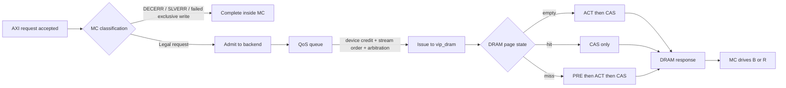

# Memory Controller Primer for `vip_mc`

This primer gives the memory-controller background needed to read and extend
`vip_mc`. It is intentionally practical: it explains the bridge between a
host protocol such as AXI4 or CHI and the neutral DRAM request stream consumed
by `vip_dram`.

`vip_mc` is not a pin-accurate DDR controller. It is a behavioral controller VIP
that accepts host requests, checks and reshapes them, schedules them under a
controller policy, and sends neutral read/write/refresh operations to
`vip_dram`. The goal is enough realism for protocol tests, latency checks,
scoreboards, and performance counters to see believable controller behavior.

---

## Table of contents

1. [What a memory controller does](#1-what-a-memory-controller-does)
2. [Where `vip_mc` sits](#2-where-vip_mc-sits)
3. [Request lifetime](#3-request-lifetime)
4. [Address mapping](#4-address-mapping)
5. [Rows, pages, and bank state](#5-rows-pages-and-bank-state)
6. [Scheduling policy](#6-scheduling-policy)
7. [Refresh, reset, and initialization](#7-refresh-reset-and-initialization)
8. [Host protocol adaptation](#8-host-protocol-adaptation)
9. [Timing model and scoreboarding](#9-timing-model-and-scoreboarding)
10. [How this maps onto the code](#10-how-this-maps-onto-the-code)
11. [MC to DRAM request examples](#11-mc-to-dram-request-examples)
12. [Glossary](#12-glossary)

---

## 1. What a memory controller does

A memory controller sits between host-facing protocols and DRAM devices. The
host side speaks in bus transactions: AXI4 reads and writes, or CHI memory-target
requests. The DRAM side speaks in row and column accesses that must respect
device timing, page state, refresh, and bus turnaround constraints.

```text
AXI4 / CHI requester
  |
  | host transaction
  v
+-------------------+
| memory controller |
+-------------------+
  |
  | neutral read / write / refresh request
  v
+-------------------+
| DRAM model        |
+-------------------+
  |
  | storage update / read data
  v
+-------------------+
| memory store      |
+-------------------+
```

In practical terms, the controller owns:

- protocol acceptance and response behavior,
- address ownership and decode policy,
- burst legality checks,
- packing and scattering host beats into DRAM row words,
- outstanding transaction limits,
- queueing, arbitration, QoS, and fairness,
- refresh insertion,
- reset and bring-up sequencing,
- response timing back onto the host bus.

The DRAM model owns:

- rank, bank-group, bank, row, column, beat, and byte decode,
- open-row state for every bank,
- page empty / hit / miss classification,
- ACT / RD / WR / PRE / REF timing,
- first-beat and last-beat readiness,
- memory storage and injected read fault severity.

That split is the main design boundary in this VIP.

---

## 2. Where `vip_mc` sits

`vip_mc` has protocol-specific front-ends over one shared backend. The backend
is deliberately protocol-agnostic: once a request becomes a `vip_mc_cmd_entry`,
the scheduling and DRAM issue path no longer cares whether it came from AXI4 or
CHI.

```text
                      +-------------------------+
AXI4 manager traffic  | AXI4 front-end          |
--------------------->| `vip_mc_axi4_driver`    |\
                      +-------------------------+ \
                                                  v
                                            +--------------+     +------------+
                                            | MC backend   |---->| vip_dram   |
                                            | queue/issue  |<----| scheduler  |
                                            +--------------+     +------------+
                                                  ^
                      +-------------------------+ /
CHI RN-I traffic     | CHI SN front-end        |/
-------------------->| `vip_mc_chi_driver`     |
                      +-------------------------+
```

The current CHI front-end is optional and enabled with
`+define+VIP_MC_ENABLE_CHI`. In AXI4-only builds, the core controller package does
not need to compile against `vip_chi`.

---

## 3. Request lifetime

A normal request passes through five controller phases:

| Phase | Meaning |
| --- | --- |
| Front-end accept | The host protocol handshakes a complete request, or enough of one to start tracking it. |
| Classify | The front-end checks ownership, local error windows, burst shape, and protocol-specific rules. |
| Admit | The request is converted into a `vip_mc_cmd_entry` and handed to the backend. |
| Queue and issue | The backend arbitrates among ports, QoS classes, refresh, same-stream ordering, and device credits. |
| Complete | A `vip_dram_rsp` returns, timing/data are copied back, and the owning front-end drives the host response. |

Some requests stop early. A DECERR, unsupported burst, unsupported CHI opcode, or
failed AXI4 exclusive write can be completed locally by the front-end. In those
cases DRAM never sees a request and memory contents do not change.

---

## 4. Address mapping

The host presents a byte address. The controller and DRAM must agree on how that
byte address decomposes into device fields:

```text
system byte address
  |
  v
+------+   +------+   +------------+   +------+   +------+   +------+
| rank |-->| bank |-->| row/page   |-->| col  |-->| beat |-->| byte |
+------+   +------+   +------------+   +------+   +------+   +------+
```

`vip_mc_config.addr_map_policy` is copied into `vip_dram` at start of
simulation, so the controller's scheduling predictions and the DRAM device model
use the same decode. The default map is the normal LSB-first layout:
`[byte][col][bank][bg][row][rank]`.

This matters because row-buffer behavior depends on address mapping. Two
adjacent host bursts may land in the same open row, different columns of one
row, different banks, or different ranks depending on the map and geometry.

---

## 5. Rows, pages, and bank state

Each DRAM bank has one row buffer. A request can see three important states:

| State | Meaning | Cost shape |
| --- | --- | --- |
| Page empty | The bank is closed / precharged. | Activate the target row, then access the column. |
| Page hit | The bank already has the target row open. | Issue the column access directly, subject to spacing rules. |
| Page miss | The bank has a different row open. | Precharge the old row, activate the new row, then access the column. |

`vip_dram` currently behaves as an open-page device model: after a legal read or
write, the target row stays open. That makes page locality visible to the MC
backend and to tests that compare FCFS against FR-FCFS scheduling.

---

## 6. Scheduling policy

The backend turns many possible request sources into one device request stream.
Its choices are constrained by correctness first and policy second.

Correctness constraints:

- same-stream ordering must be preserved where the host protocol requires it,
- the finite device in-flight window must not be exceeded,
- response-buffer credits must be available when finite buffering is enabled,
- refresh must be inserted through the same device-bound path as normal traffic,
- reset must flush queued and in-flight controller work.

Policy knobs then decide which eligible command wins:

- port arbitration weight,
- QoS class,
- QoS aging,
- FR-FCFS readiness prediction,
- FR-FCFS starvation cap,
- read/write grouping and maximum same-direction run length.

FR-FCFS means "first ready, first come first served". In this VIP, the backend
uses `vip_dram.predict()` to estimate which eligible request will complete
soonest. That tends to prefer page hits over page misses while still preserving
same-stream ordering and any configured fairness caps.

---

## 7. Refresh, reset, and initialization

DRAM requires periodic refresh. `vip_mc_refresh` emits controller-internal REF
commands that enter the backend beside normal traffic. A refresh occupies a rank
for `tRFC`; normal requests to that rank wait until refresh completes.

Two refresh modes are modeled:

| Mode | Behavior |
| --- | --- |
| Periodic | Emit refresh at the configured `tREFI` cadence. |
| Deferred | Accrue refresh debt up to `refresh_max_deferred`, then force catch-up refreshes. |

Reset has two sides:

- front-ends stop accepting or driving protocol traffic and clear local queues,
- the backend and refresh engine flush controller work and call the blocking
  `dram.reset()` path.

Optional initialization delay lets the controller accept and queue host traffic
while holding device issue closed for `init_delay_ns` after reset deassertion.

---

## 8. Host protocol adaptation

The front-ends translate host-specific details into the neutral command entry.

For AXI4, this includes:

- collecting `AW` and all `W` beats before issuing a write,
- accepting `AR` for reads,
- validating `INCR`, `FIXED`, `WRAP`, narrow, and unaligned transfers,
- detecting 4 KB boundary violations,
- tracking outstanding read/write limits,
- handling `B` and `R` response queues,
- preserving AXI4 USER and exclusive-access outcomes.

For CHI SN mode, this includes:

- link activation and credit exchange,
- accepting the supported ReadNoSnp / WriteNoSnp memory-target subset,
- mapping combined or split write responses,
- returning Comp / DBIDResp / CompDBIDResp / CompData / DataSepResp /
  ReadReceipt as needed,
- rejecting unsupported opcodes with a defined error response.

Once converted, both protocols use the same backend scheduling and DRAM model.

---

## 9. Timing model and scoreboarding

The DRAM response carries absolute-time readiness:

- `first_beat_ready_time`,
- `last_beat_ready_time`,
- page classification flags,
- returned data or completion status.

The MC snaps those times back onto the controller clock. For reads, the AXI4
front-end can pace beats from first to last when `honor_beat_timing` is enabled.
For writes, `BVALID` is driven no earlier than the returned last-beat time.

The example scoreboard checks observed host response timing against
`vip_dram.predict()`. That is intentionally a latency model, not a complete
memory-data scoreboard. Features that transform completion shape, such as write
coalescing or ECC response remapping, may require focused tests instead of the
generic latency scoreboard.

---

## 10. How this maps onto the code

| File | Role |
| --- | --- |
| [`../sv/vip_mc.sv`](../sv/vip_mc.sv) | Top-level UVM component that builds front-ends, backend, and refresh. |
| [`../sv/vip_mc_config.sv`](../sv/vip_mc_config.sv) | Shared policy and geometry configuration. |
| [`../sv/vip_mc_axi4_driver.sv`](../sv/vip_mc_axi4_driver.sv) | AXI4 protocol translation and response driving. |
| [`../sv/vip_mc_chi_driver.sv`](../sv/vip_mc_chi_driver.sv) | Optional CHI SN protocol translation and response driving. |
| [`../sv/vip_mc_cmd_entry.sv`](../sv/vip_mc_cmd_entry.sv) | Canonical request/completion object shared across front-ends and backend. |
| [`../sv/vip_mc_cmd_queue.sv`](../sv/vip_mc_cmd_queue.sv) | QoS, same-stream ordering, in-flight tag tracking, and eligible-pick logic. |
| [`../sv/vip_mc_backend.sv`](../sv/vip_mc_backend.sv) | Port arbitration, device-credit gating, DRAM issue, and completion dispatch. |
| [`../sv/vip_mc_refresh.sv`](../sv/vip_mc_refresh.sv) | Refresh command generation. |
| [`../submodules/vip_dram/sv/vip_dram_scheduler.sv`](../submodules/vip_dram/sv/vip_dram_scheduler.sv) | DRAM page classification and timing scheduler. |

---

## 11. MC to DRAM request examples

This section embeds the request walkthrough that was previously kept as a
standalone note. It matches the behavior in
[`vip_mc_axi4_driver.sv`](../sv/vip_mc_axi4_driver.sv),
[`vip_mc_backend.sv`](../sv/vip_mc_backend.sv),
[`vip_mc_cmd_queue.sv`](../sv/vip_mc_cmd_queue.sv),
[`vip_mc_refresh.sv`](../sv/vip_mc_refresh.sv), and
[`vip_dram_scheduler.sv`](../submodules/vip_dram/sv/vip_dram_scheduler.sv).

One important terminology point: in this model, a "miss" is a DRAM page miss,
not a cache miss. It means the target bank already has a different row open, so
the DRAM must precharge the old row and activate the new one before the access
can complete.

### Reading the tables

The first column uses relative controller-clock deltas (`0`, `1`, `2`, `N`,
`N+1`) because that is easier to reason about from the AXI side.

- `0` means the cycle where the MC accepts the request.
- `N` means "some later controller clock edge once the DRAM timing has matured."
- The exact latency is not fixed in cycles because `vip_dram` schedules in
  absolute nanoseconds and returns `first_beat_ready_time` /
  `last_beat_ready_time`.

### Big picture example flow



### State cheat sheet

#### MC-side request states

| MC state | What it means |
| --- | --- |
| Front-end accept | `AR` or `AW/W` handshake completed and the driver built a `vip_mc_cmd_entry`. |
| Pre-resolved | The request failed local checks in the MC, so the frontend completes it without touching DRAM. |
| Admitted | The backend has accepted the entry into its internal command queue. |
| Queued | The request is waiting on QoS priority, same-stream ordering, refresh, or the finite `max_inflight_to_device` window. |
| Issued | The backend stamped a DRAM tag and sent a `vip_dram_req`. |
| Completed | A `vip_dram_rsp` returned and the frontend can now drive `R` or `B`. |

#### DRAM-side bank states and page outcomes

| DRAM condition before the access | Meaning | What the response reports |
| --- | --- | --- |
| `IDLE` | Bank is closed / precharged. | `was_page_empty = 1` |
| `ACTIVE` and `open_row == requested_row` | Right row is already open. | `was_page_hit = 1` |
| `ACTIVE` and `open_row != requested_row` | Wrong row is open. | `was_page_miss = 1` |
| Rank busy due to refresh | Access must wait until `tRFC` ends. | No separate page flag; the request is delayed |

Current note: the delivered scheduler behaves as OPEN-page DRAM. After a legal
read or write, the row stays open, so the next access to that same row can hit.

### Example 1: First read into a closed bank (page empty)

This is the normal "cold" access. Nothing is open yet in the target bank.

| Delta | What happens in the MC | What happens in the DRAM |
| --- | --- | --- |
| 0 | `AR` handshakes. The AXI frontend checks address ownership, DECERR windows, 4 KB crossing, burst legality, and exclusive rules. The request is legal, so it builds one `vip_mc_cmd_entry`. | No DRAM activity yet. The target bank is still `IDLE`. |
| 1 | The backend admits the entry into the command queue. If device credit is free, it may issue immediately. | Still no state change. |
| 2 | The backend stamps a DRAM tag and issues the request. | The scheduler classifies the access as page empty because the bank is closed. It schedules `ACT`, waits `tRCD`, then schedules the first `RD` CAS. |
| N | The backend receives the `vip_dram_rsp` and hands the completed command back to the AXI frontend. | The bank becomes `ACTIVE` on the requested row. The response carries `was_page_empty = 1` plus `first_beat_ready_time` and `last_beat_ready_time`. |
| N+1 | The frontend starts driving `RVALID` on the first controller clock edge at-or-after `first_beat_ready_time`. For a multi-beat read, later beats are paced until `RLAST`. | DRAM has finished the access and leaves the row open. |

Why it matters: this case pays the row-open cost. The next access to the same
row can be faster.

### Example 2: Follow-up read to the same open row (page hit)

Now assume Example 1 already completed and the bank is still open on the same
row.

| Delta | What happens in the MC | What happens in the DRAM |
| --- | --- | --- |
| 0 | A new `AR` handshakes and passes the same legality checks. The frontend emits a fresh command entry. | The bank is already `ACTIVE` on the requested row. |
| 1 | The backend issues the request as soon as arbitration and device credit allow. | The scheduler classifies a page hit. There is no `PRE` and no new `ACT`; the first CAS is only gated by column spacing and any read/write turnaround limits. |
| N | The DRAM response returns. | The response carries `was_page_hit = 1`. The open row stays the same. |
| N+1 | The AXI frontend drives `RVALID`. This usually comes back sooner than Example 1 because the row-open work was skipped. | No new row-state transition is needed. |

Why it matters: this is the best-case steady-state read path for an OPEN-page
bank.

### Example 3: Write to a different row in the same bank (page miss and DRAM update)

This is the case people often mean when they say the controller "causes a miss"
while updating DRAM.

| Delta | What happens in the MC | What happens in the DRAM |
| --- | --- | --- |
| 0 | `AW` handshakes. The frontend records the write address, burst shape, QoS, and exclusive information. | The bank is `ACTIVE`, but on the wrong row for this write. |
| 1..M | `W` beats arrive. The frontend packs them into row-granular `wdata` / `wstrb`. The request is not issued yet because the MC waits until the burst is complete. | Still no DRAM mutation yet. |
| M+1 | `WLAST` arrives. If the burst is still legal, the frontend emits the write command entry into the backend. | The old row is still open. |
| M+2 | The backend tags and issues the write once it wins arbitration and device credit exists. | The scheduler classifies a page miss. It must `PRE` the old row, respect `tRP`, `ACT` the new row, then issue `WR`. |
| N | The backend receives the write completion. | DRAM storage has now been updated. The response carries `was_page_miss = 1`. The bank stays `ACTIVE` on the new row because the current model behaves as OPEN-page. |
| N+1 | The AXI frontend drives `BVALID` on the first controller clock edge at-or-after `last_beat_ready_time`. | Future accesses to this new row can now hit. |

Why it matters: compared with a hit, a miss adds the old-row close plus
new-row open work before the write can land.

### Example 4: Request waits in the MC before DRAM ever sees it

Not every delay is a DRAM timing delay. Sometimes the request is buffered in the
MC because the backend is full or older traffic must go first.

| Delta | What happens in the MC | What happens in the DRAM |
| --- | --- | --- |
| 0 | The frontend accepts a legal read or write and publishes a command entry. | No DRAM request exists yet. |
| 1 | The backend admits the entry into its QoS queue. | Still nothing at DRAM. |
| 2..Q | The request stays queued because at least one of these is true: `max_inflight_to_device` is full, an older same-stream request must retire first, a higher-priority QoS entry was selected, or a refresh entry is ahead. | DRAM continues serving older commands or a refresh. The new request is invisible to DRAM during this whole interval. |
| Q+1 | Once a device slot frees and arbitration picks this entry, the backend issues it. | Only now does DRAM classify it as hit / miss / empty and start real timing work. |

Why it matters: if the bus sees extra latency but the DRAM page classification
looks favorable, the delay may have been in the MC queue rather than in DRAM.

### Example 5: Refresh delays a normal request

Refresh is modeled as MC-generated `REF` commands that share the same backend.

| Delta | What happens in the MC | What happens in the DRAM |
| --- | --- | --- |
| 0 | A normal read or write is accepted by the frontend. | Target rank may still be available right now. |
| 1 | The refresh thread emits one internal `REF` command per rank when the cached `tREFI` interval expires. | No refresh effect yet until the backend issues it. |
| 2 | The backend gives the refresh entry a turn before or between normal requests. | `vip_dram` performs rank refresh. All banks in that rank are effectively closed and the rank is busy until `tRFC` completes. |
| 3..R | A queued normal request cannot start on that rank yet, even if it would otherwise be a hit. | The rank stays blocked during refresh. |
| R+1 | The backend issues the normal request after refresh and any other older work. | The request is then classified again as empty / hit / miss using the post-refresh bank state. In practice refresh leaves banks closed, so the next access is often page empty. |

Why it matters: refresh can turn what would have been a hit before refresh into
an empty-bank access after refresh.

### Example 6: MC rejects the request and DRAM never changes

This is the shortest path and a useful debug branch to remember.

| Delta | What happens in the MC | What happens in the DRAM |
| --- | --- | --- |
| 0 | The frontend accepts `AR` or `AW`, but classification fails: wrong address ownership, DECERR window hit, 4 KB boundary crossing, unsupported burst, or unsupported exclusive shape. | DRAM sees nothing. |
| 1 | The frontend marks the entry `pre_resolved` and completes it locally with `DECERR`, `SLVERR`, or a failed exclusive-write `OKAY`. | No bank state, row state, or memory contents change. |
| 2 | The frontend drives the response back on `R` or `B`. | Still untouched. |

Why it matters: if you expected memory to change and nothing did, confirm that
the request was not resolved locally inside the MC.

### What to watch in waves or logs

| Observable | Why it helps |
| --- | --- |
| `vip_mc_backend.issued_port` | Shows when the backend actually issued a request toward DRAM. |
| `vip_mc_cmd_queue` depth and pick behavior | Distinguishes MC queueing delays from DRAM timing delays. |
| `vip_dram_rsp.was_page_hit` / `was_page_miss` / `was_page_empty` | Tells you how DRAM classified the access. |
| `first_beat_ready_time` / `last_beat_ready_time` | Explains why `RVALID` or `BVALID` appeared on a particular cycle. |
| AXI frontend pending `AW` / `R` / `B` behavior | Shows whether delay came from burst assembly, response pacing, or bus backpressure. |

### Practical debug rules of thumb

1. If DRAM never sees a request, debug the frontend classification path first.
2. If DRAM sees the request late, debug the MC queue, refresh, and device-credit limits.
3. If DRAM sees the request immediately but the response is slow, debug page hit/miss/empty classification and the DRAM timing preset.
4. If a write changed memory but `BVALID` still looks late, remember that the AXI frontend drives `B` at `last_beat_ready_time`, not at request issue time.

---

## 12. Glossary

| Term | Meaning |
| --- | --- |
| ACT | DRAM activate command; opens a row in a bank. |
| CAS | Column access command; the RD or WR part after a row is open. |
| FR-FCFS | First-ready, first-come-first-served scheduling. Usually favors commands predicted to complete soon, such as page hits. |
| Page | The currently open row in one bank. |
| Page empty | The target bank is closed, so the row must be activated. |
| Page hit | The target row is already open in the target bank. |
| Page miss | A different row is open in the target bank, so the bank must be precharged before the target row can be activated. |
| PRE | DRAM precharge command; closes the currently open row. |
| REF | DRAM refresh command; blocks a rank and refreshes stored cell charge. |
| Same stream | The request identity subset that must preserve ordering, such as an AXI4 `{port, id, direction}` stream. |
